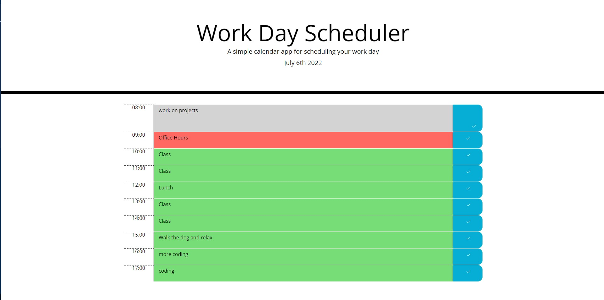

# work-day-scheduler

## Project Description
This is a coding challenge for unit 5 of the UT Austin Coding Bootcamp. The goal of this project was to make a work day scheduler that stored input to local storage and dynamically changed colors based on the time of day 

## How to Use This Project
1) Go to  https://adamwagh512.github.io/work-day-scheduler/
2) Enter your appointments on the appropriate timebar
3) click the blue save button on the right side of the page to save the appointment
4) refresh the page to ensure that the data was saved
5) Enjoy a more structured daily schedule

## Credits
Couldn't find exact save icon used in demo, so I used the check2 icon found here: https://icons.getbootstrap.com/icons/check2/

Special Thanks to TAs Ian and Diem for all of their invaluable help during this project. I would also like to thank my tutor Rukshan Uddin for helping me better understand some of the code and giving me some resources that really helped me finish this project. 

## License
MIT License

Copyright (c) 2022 adamwagh512

Permission is hereby granted, free of charge, to any person obtaining a copy
of this software and associated documentation files (the "Software"), to deal
in the Software without restriction, including without limitation the rights
to use, copy, modify, merge, publish, distribute, sublicense, and/or sell
copies of the Software, and to permit persons to whom the Software is
furnished to do so, subject to the following conditions:

The above copyright notice and this permission notice shall be included in all
copies or substantial portions of the Software.

THE SOFTWARE IS PROVIDED "AS IS", WITHOUT WARRANTY OF ANY KIND, EXPRESS OR
IMPLIED, INCLUDING BUT NOT LIMITED TO THE WARRANTIES OF MERCHANTABILITY,
FITNESS FOR A PARTICULAR PURPOSE AND NONINFRINGEMENT. IN NO EVENT SHALL THE
AUTHORS OR COPYRIGHT HOLDERS BE LIABLE FOR ANY CLAIM, DAMAGES OR OTHER
LIABILITY, WHETHER IN AN ACTION OF CONTRACT, TORT OR OTHERWISE, ARISING FROM,
OUT OF OR IN CONNECTION WITH THE SOFTWARE OR THE USE OR OTHER DEALINGS IN THE SOFTWARE.

